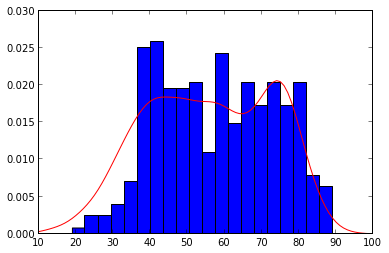

# Analytics with SciPy and sci-kit learn


Here we are going to study 2012 temperature data in New York City.  

SciPy refers to several related but distinct entities:

The Scipy Stack, a collection of open source software for scientific computing in Python, and particularly a specified set of core packages.
The community of people who use and develop this stack.
Several conferences dedicated to scientific computing in Python - Scipy, EuroScipy and Scipy.in.
The SciPy library, one component of the Scipy stack, providing many numerical routines.

The Scipy Stack

Python, a general purpose programming language. It is interpreted and dynamically typed and is very suited for interactive work and quick prototyping, while being powerful enough to write large applications in.

NumPy, the fundamental package for numerical computation. It defines the numerical array and matrix types and basic operations on them.

The SciPy library, a collection of numerical algorithms and domain-specific toolboxes, including signal processing, optimization, statistics and much more.

Matplotlib, a mature and popular plotting package, that provides publication-quality 2D plotting as well as rudimentary 3D plotting

pandas, providing high-performance, easy to use data structures.

SymPy, for symbolic mathematics and computer algebra.

IPython, a rich interactive interface, letting you quickly process data and test ideas. The IPython notebook works in your web browser, allowing you to document your computation in an easily reproducible form.

nose, a framework for testing Python code.


### Import Modules


```python
import numpy as np
import zipfile
import os
import urllib2
```


```python
url = 'http://files.figshare.com/1116528/weather.zip'

print 'Downloading Stations CSV'

response = urllib2.urlopen(url)

fname = 'weather.zip'
with open(fname,'wb') as f:
    f.write(response.read())

zfile = zipfile.ZipFile("weather.zip")
dirname = zfile.namelist()[0]

#check if directory exists
if not os.path.exists(dirname):
    os.mkdir(dirname)
    
for name in zfile.namelist()[1:]:
    print name
    with open(name,"w") as f:
        f.write(zfile.read(name))
```

    Downloading Stations CSV
    weather/CALOSANG.txt
    weather/CASANFRA.txt
    weather/INSOBEND.txt
    weather/KYLEXING.txt
    weather/MDWASHDC.txt
    weather/NYNEWYOR.txt
    weather/WASEATTL.txt


```python
dt = np.dtype([('Month', 'int8'), ('Day', 'int8'), ('Year', 'int16'), ('Temp', 'float64')])
data = np.loadtxt('weather/NYNEWYOR.txt',dtype=dt)
data[:5]
total_days = len(data)
```


```python
year2012 = data[data['Year']==2012]
```

SciPy contains several modules/toolboxes dedicated to common issues in scientific computing.  While a given domain will need tools from several different modules,
the modules have been separated for different computing applications.  At a high level there are modules for

- Linear Algebra
- Fitting and Optimizing functions
- Statistics
- Integration
- Interpolation

And a few other modules for signal and image processing and other more specialized computing.


```python
from scipy import stats
import scipy as sp
```

Descriptive statistics are baked in.

skew, kurtosis are the 3rd and 4th order moments of the distribution.


```python
def describe_data(x):
    n, min_max, mean, var, skew, kurt = sp.stats.describe(x)
    print 'number of points: ', n
    print 'min/max: ', min_max
    print 'mean: ', mean
    print 'variance: ', var
    print 'skew: ', skew
    print 'kurtosis: ', kurt
    print 'median: ', sp.median(x)
    
describe_data(year2012['Temp'])
```

    number of points:  366
    min/max:  (19.100000000000001, 89.200000000000003)
    mean:  58.068579235
    variance:  247.366873044
    skew:  0.00160652566232
    kurtosis:  -1.01332994349
    median:  58.25


Quartile calculation, demarcators of boundaries of median, etc.. of data


```python
sp.stats.mstats.mquantiles(year2012['Temp'],[0.5, 0.75, 1.0])
```


    array([ 58.25 ,  71.805,  89.2  ])


SciPy's stats package has many convenience functions for handling continuous and discrete random variables.  This is an advanced topic that we'll briefly dive into here.

### Fitting a distribution with known parameters


```python
%pylab inline
import matplotlib.pyplot as plt
```

    Populating the interactive namespace from numpy and matplotlib


```python
import numpy as np
np.random.seed(1)
# create random variables
rnd = sp.stats.norm.rvs(loc=25,scale=1,size=150) 

param = sp.stats.norm.fit(rnd) # distribution fitting

# now, param[0] and param[1] are the mean and 
# the standard deviation of the fitted distribution
print param
x = np.linspace(20,30,100)
# fitted distribution
pdf_fitted = sp.stats.norm.pdf(x,loc=param[0],scale=param[1])

plt.title('Normal distribution')
plt.plot(x,pdf_fitted,'r-')
plt.plot(x,pdf_fitted+0.1,'g-')
plt.hist(rnd,normed=1,alpha=.3);
```

    (25.068608210737064, 0.88072985039898022)


```python
plt.hist(year2012['Temp'],bins=20);
```


A common way to estimate an unknown probability density function from a collection of samples of random variables (here, the Temperature), is the Gaussian KDE, where KDE stands for kernel density estimation.

You deliver your data to the function, and SciPy stats runs the advanced statistical tool for you.


```python
pdf = sp.stats.gaussian_kde(data['Temp'])
x = np.arange(10,100)
plt.hist(year2012['Temp'],bins=20,normed=True)
plt.plot(x,pdf(x),'r-');
```





Let's add more data.  


```python
import glob
files = glob.glob('weather/*.txt')
names = [os.path.splitext(os.path.basename(file))[0] for file in files]
print files
```

    ['weather/CALOSANG.txt', 'weather/CASANFRA.txt', 'weather/INSOBEND.txt', 'weather/KYLEXING.txt', 'weather/MDWASHDC.txt', 'weather/NYNEWYOR.txt', 'weather/WASEATTL.txt']


We have a large collection of data that we'd like to analyze as a single array spread out across multiple files.  In this case, the chunks of data in each are compatible.  We'll use a vstack here of a concatenate, but in general you may need to use concatenate for merging irregularly-sized arrays.

globbing = pattern matching based on wildcard characters, the most common of which is the *.


```python
dt = np.dtype([('Month', 'int8'), ('Day', 'int8'), ('Year', 'int16'), ('Temp', 'float64')])
total_temps = []
files = glob.glob('weather/*.txt')
for f in files:
    t_data = np.loadtxt(f,dtype=dt)
    total_temps.append(t_data['Temp'])
```


```python
total_temps = np.vstack(total_temps).flatten()
print total_temps.shape
```

    (47243,)


47243/7/365 18.5 years of 7 stations collecting data daily


```python
pdf = sp.stats.gaussian_kde(total_temps)
x = np.arange(20,100)
plt.hist(total_temps,bins=20,normed=True)
plt.plot(x,pdf(x),'r-');
```


That looks a bit more Gaussian.  Can we fit it?


```python
param = sp.stats.norm.fit(total_temps) # distribution fitting

# now, param[0] and param[1] are the mean and 
# the standard deviation of the fitted distribution
print param
x = np.linspace(0,100,1000)
# fitted distribution
pdf_fitted = sp.stats.norm.pdf(x,loc=param[0],scale=param[1])

title('Normal distribution')
plt.plot(x,pdf_fitted,'r-')
plt.hist(total_temps,bins=25,normed=1,alpha=.3);
```

    (55.379681645957902, 16.856163815848234)


```python
describe_data(total_temps)
describe_data(total_temps[total_temps != -99])
```

    number of points:  47243
    min/max:  (-99.0, 93.700000000000003)
    mean:  55.379681646
    variance:  284.136272944
    skew:  -2.54620571787
    kurtosis:  19.9386012172
    median:  57.2
    number of points:  47100
    min/max:  (-11.199999999999999, 93.700000000000003)
    mean:  55.8483927813
    variance:  212.418248547
    skew:  -0.439186571362
    kurtosis:  -0.00406997817694
    median:  57.3


```python
total_temps = total_temps[total_temps != -99]

param = sp.stats.norm.fit(total_temps) # distribution fitting

# now, param[0] and param[1] are the mean and 
# the standard deviation of the fitted distribution
print param
x = np.linspace(0,100,1000)
# fitted distribution
pdf_fitted = sp.stats.norm.pdf(x,loc=param[0],scale=param[1])

title('Normal distribution')
plt.plot(x,pdf_fitted,'r-')
plt.hist(total_temps,bins=25,normed=1,alpha=.3);
```

    (55.848392781316178, 14.574420695376137)


##5.3 Fitting and interpolation


```python
dt = np.dtype([('Month', 'int8'), ('Day', 'int8'), ('Year', 'int16'), ('Temp', 'float64')])
data = np.loadtxt('weather/NYNEWYOR.txt',dtype=dt)

v_idxs = np.where(data['Temp'] != -99.0)
print v_idxs

na_idxs = np.where(data['Temp'] == -99.0)
print na_idxs
```

    (array([   0,    1,    2, ..., 6746, 6747, 6748]),)
    (array([ 492,  514,  517,  518,  522, 1453, 1454, 1459, 1460, 1470, 2725,
           2726, 2727, 2728, 2806, 2934, 2981, 4622, 5015, 5212]),)


```python
data['Temp'][514:523]
```


    array([-99. ,  57.4,  58.5, -99. , -99. ,  59.7,  63.1,  65.9, -99. ])


How to clean up?  
Drop and interpolate?

np.delete in this case is deleting a row.


```python
for na in na_idxs:
    data = np.delete(data,na,0)
```

Now we have missing dates we can interpolate the values for the missing dates


```python
data[514:523][['Day','Temp']]
```


    array([(31, 58.5), (3, 59.7), (4, 63.1), (5, 65.9), (7, 69.6), (8, 74.2),
           (9, 68.9), (10, 71.4), (11, 70.8)], 
          dtype=[('Day', 'i1'), ('Temp', '<f8')])


```python
from scipy.interpolate import interp1d
x = v_idxs[0]
linterp = interp1d(x, data['Temp'],kind='linear')
```


```python
original_data = np.loadtxt('weather/NYNEWYOR.txt',dtype=dt)
plt.plot(original_data['Temp'][500:550])
xnew = np.arange(total_days)
plt.plot(linterp(xnew)[500:550]);
```


Jagged peaks are the results of the rows we dropped.  Interpolating the data fills in the holes. The argument `kind=` defines how data is filled in: `linear`, `cubic`, `nearest`.  Let's illustrate the above with lots of gaps in the data.


```python
x = np.linspace(0, 10, 10)
y = np.cos(-x**2/8.0)
f = interp1d(x, y)
f2 = interp1d(x, y, kind='cubic')
```


```python
xnew = np.linspace(0, 10, 40)
plt.plot(x,y,'o',xnew,f(xnew),'-', xnew, f2(xnew),'--')
plt.legend(['data', 'linear', 'cubic'], loc='best')
plt.show()
```


Above you can see how interpolation can help define a function over the same range but will succesfully return results for any granularity within that range.

Curve fitting is also important for understanding the behavior of physical, biological, and other data producing systems.  For example, we are pretty sure that the weather is oscillatory follows a fairly well defined period.  

# SciKit Learn Overview

SciPy covers many of the canonical scientific computing applications, howver, recent developments in statisical computing and data mining have spawned a new field: machine learning.  Scikit-learn is largely considered the standard machine learning package for Python.  Like many numerical computing packages, Scikit-learn leverages NumPy's architeture and memory model under the hood.

At a high level we can separate machine learning into two main categories:

- Supervised Learning
- Unsupervised Learning

*note: there is a gradient between these two extremes and many techniques leverage semi-supervised learning*

Generally, when we speak of supervised learning we are referencing algorithm where the data come pre-labeled.  That is, these sample are good these samples are bad, or these samples are category 1, these are category 2, etc.  Often, supervised learning is useful for predicting the category or class a new sample should have.

Unsupervised learning defines a collection of algorithms where data is not labeled.  Often there are relationships between data and we want to infer/predict those relationships.

Within machine learning there exist four main techniques: regression, dimensionality reduction, classification, and clustering. 

Scikit learn provides same inteface for many algorithms

- build predictor
- apply fit


```python
%pylab inline
import matplotlib.pyplot as plt
from sklearn import datasets
digits = datasets.load_digits()
plt.imshow(digits.images[-1], cmap=plt.cm.gray_r, interpolation='nearest')
digits.target[-1]
from sklearn import svm
clf = svm.SVC(gamma=0.001, C=100.)
clf.fit(digits.data[:-1], digits.target[:-1])
clf.predict(digits.data[-1])
```


```python

```
