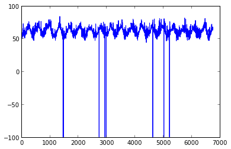
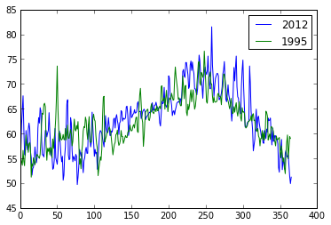
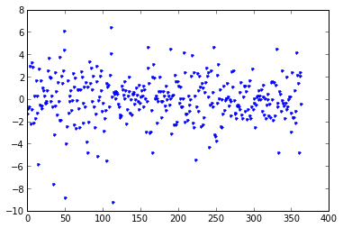
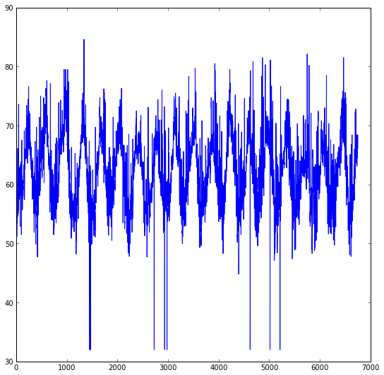
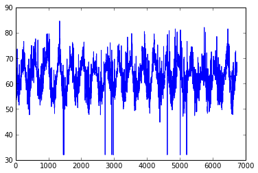

# Numerical Analysis with NumPy  

1. Understand NumPy
2. Create simple arrays of data in NumPy
3. Access and modify array elements
4. Compute on arrays


```
sales = [0.75, 1.5, 2.0, 4.0, 5.0, 6.0, 10.0]
```


```
sales*2
```


    [0.75, 1.5, 2.0, 4.0, 5.0, 6.0, 10.0, 0.75, 1.5, 2.0, 4.0, 5.0, 6.0, 10.0]


```
import numpy as np
```


```
sales = np.array(sales)
print sales
```

    [  0.75   1.5    2.     4.     5.     6.    10.  ]


Basic Math


```
sales+1
```


    array([  1.75,   2.5 ,   3.  ,   5.  ,   6.  ,   7.  ,  11.  ])


```
sales*2
```


    array([  1.5,   3. ,   4. ,   8. ,  10. ,  12. ,  20. ])


```
np.power(sales, 2)
```


    array([   0.5625,    2.25  ,    4.    ,   16.    ,   25.    ,   36.    ,
            100.    ])


### What is NumPy?

Python library that provides multi-dimensional arrays, tables, and matrices for Python

- Contiguous or strided arrays
- Homogeneous (but types can be algebraic)
- Arrays of records and nested records
- Fast routines for array operations (C, ATLAS, MKL)

### NumPy's Many Uses

- Image and signal processing
- Linear algebra
- Data transformation and query
- Time series analysis
- Statistical analysis
- Many more!

## Create Arrays of Data in NumPy

Lots of methods of array initialization

- python list
- zeros
- ones
- diagonal
- eye 
- random


```
np.zeros(5)
```


    array([ 0.,  0.,  0.,  0.,  0.])


```
np.ones(5)
```


    array([ 1.,  1.,  1.,  1.,  1.])


```
np.random.random(5)
```


    array([ 0.59199193,  0.56786835,  0.25217292,  0.82806812,  0.85314457])


```
np.diag([1,1,1,1,1])
```


    array([[1, 0, 0, 0, 0],
           [0, 1, 0, 0, 0],
           [0, 0, 1, 0, 0],
           [0, 0, 0, 1, 0],
           [0, 0, 0, 0, 1]])


NumPy also has methods for generating linearly/log spaced values


```
np.arange(0,10)
```


    array([0, 1, 2, 3, 4, 5, 6, 7, 8, 9])


```
np.arange(10,30,2)
```


    array([10, 12, 14, 16, 18, 20, 22, 24, 26, 28])


```
np.linspace(0,2,10)
```


    array([ 0.        ,  0.22222222,  0.44444444,  0.66666667,  0.88888889,
            1.11111111,  1.33333333,  1.55555556,  1.77777778,  2.        ])


NumPy has a type and a shape.  The above array are either floats or ints, but these are infered.  We could be explicit


```
np.ones(5)
```


    array([ 1.,  1.,  1.,  1.,  1.])


```
np.ones(5,dtype='int64')
```


    array([1, 1, 1, 1, 1])


We also can define the shape of the array


```
np.ones(shape=(3,3),dtype='float64')
```


    array([[ 1.,  1.,  1.],
           [ 1.,  1.,  1.],
           [ 1.,  1.,  1.]])


```
np.random.uniform(0,1,size=(5,5))
```


    array([[ 0.77209739,  0.75064147,  0.24405998,  0.74056324,  0.78689691],
           [ 0.54713534,  0.59139219,  0.32833556,  0.09347192,  0.25629042],
           [ 0.6468012 ,  0.5379572 ,  0.52616472,  0.45787742,  0.40614121],
           [ 0.87068529,  0.66309364,  0.99586609,  0.62686808,  0.20264919],
           [ 0.56295429,  0.9749758 ,  0.39944626,  0.20179949,  0.77004972]])


###Multidimensional properties


```
data = np.zeros(9)
print data
```

    [ 0.  0.  0.  0.  0.  0.  0.  0.  0.]


```
data.reshape((3,3,))
```


    array([[ 0.,  0.,  0.],
           [ 0.,  0.,  0.],
           [ 0.,  0.,  0.]])


```
data = data.reshape((3,3))
data[0,0] = 12
data[1,0] = 13
data[2,0] = 14
print data
```

    [[ 12.   0.   0.]
     [ 13.   0.   0.]
     [ 14.   0.   0.]]


Data access is arr[row, column]

reshaping is just another view of the same data.  no 


```
#row selection
print data[0,:]
#column selection
print data[:,0]
```

    [ 12.   0.   0.]
    [ 12.  13.  14.]


```
data[:,1] = 0.2
print data
```

    [[ 12.    0.2   0. ]
     [ 13.    0.2   0. ]
     [ 14.    0.2   0. ]]


```
data[:,2] = [.3,.4,9.12]
print data
```

    [[ 12.     0.2    0.3 ]
     [ 13.     0.2    0.4 ]
     [ 14.     0.2    9.12]]


In last cell, shape of assignment must match shape of accessed data

Motivate next section with real data

#### Import Modules 


```
import numpy as np
import zipfile
import os
import urllib2
```

#### Download Data

We've gone ahead and bundled up a small bucket of this data for our analysis today at http://figshare.com/articles/GSOD_Weather_NOAA/743699

We can grab the data from the following permanent URL:
http://files.figshare.com/1116528/weather.zip


```
dirname = 'weather'
if os.path.exists(dirname):
    print 'weather directory exists, skipping download/unzip'
else:
    os.mkdir(dirname)

    url = 'http://files.figshare.com/1116528/weather.zip'
    response = urllib2.urlopen(url)

    fname = 'weather.zip'
    with open(fname,'wb') as f:
        f.write(response.read())

    zfile = zipfile.ZipFile('weather.zip')
    
    for name in zfile.namelist()[1:]:
        print name
        with open(name,"w") as f:
            f.write(zfile.read(name))

```

    weather directory exists, skipping download/unzip


#### What does the text file look like?


```
with open('weather/CALOSANG.txt','r') as f:
    print '\n'.join(f.readlines()[:3])
```

     1             1             1995         56.4
    
     1             2             1995         55.1
    
     1             3             1995         54.3
    


This text file is 
- Month
- Day
- Year
- Temp

#### Load data file into numpy array and print first row


```
w_data = np.loadtxt('weather/CALOSANG.txt')
w_data[0] 
```


    array([  1.00000000e+00,   1.00000000e+00,   1.99500000e+03,
             5.64000000e+01])


#### We can do a bit better if we define a `dtype`.  That is, the type for each column: string, int, float


```
dt = np.dtype([('Month', 'int8'), ('Day', 'int8'), ('Year', 'int16'), ('Temp', 'float64')])
w_data = np.loadtxt('weather/CALOSANG.txt',dtype=dt)
w_data[:5] 
```


    array([(1, 1, 1995, 56.4), (1, 2, 1995, 55.1), (1, 3, 1995, 54.3),
           (1, 4, 1995, 53.6), (1, 5, 1995, 56.6)], 
          dtype=[('Month', 'i1'), ('Day', 'i1'), ('Year', '<i2'), ('Temp', '<f8')])


##  Access and Modify Array Elements


```
dt = np.dtype([('Month', 'int8'), ('Day', 'int8'), ('Year', 'int16'), ('Temp', 'float64')])
data = np.loadtxt('weather/CALOSANG.txt',dtype=dt)
```

###Slicing
- first 5 rows
- rows 30 35
- every other row

#### Row Selection


```
data[0]
```


    (1, 1, 1995, 56.4)


```
data[0:2]
```


    array([(1, 1, 1995, 56.4), (1, 2, 1995, 55.1)], 
          dtype=[('Month', 'i1'), ('Day', 'i1'), ('Year', '<i2'), ('Temp', '<f8')])


```
data[30:35]
```


    array([(1, 31, 1995, 64.1), (2, 1, 1995, 63.9), (2, 2, 1995, 65.8),
           (2, 3, 1995, 66.1), (2, 4, 1995, 65.4)], 
          dtype=[('Month', 'i1'), ('Day', 'i1'), ('Year', '<i2'), ('Temp', '<f8')])


every other row


```
data[0:10:2] 
```


    array([(1, 1, 1995, 56.4), (1, 3, 1995, 54.3), (1, 5, 1995, 56.6),
           (1, 7, 1995, 53.5), (1, 9, 1995, 59.7)], 
          dtype=[('Month', 'i1'), ('Day', 'i1'), ('Year', '<i2'), ('Temp', '<f8')])


Last 5 rows


```
data[-5:]
```


    array([(6, 19, 2013, 66.8), (6, 20, 2013, 68.3), (6, 21, 2013, 68.4),
           (6, 22, 2013, 68.4), (6, 23, 2013, 66.1)], 
          dtype=[('Month', 'i1'), ('Day', 'i1'), ('Year', '<i2'), ('Temp', '<f8')])


Reverse entire array


```
data[::-1]
```


    array([(6, 23, 2013, 66.1), (6, 22, 2013, 68.4), (6, 21, 2013, 68.4), ...,
           (1, 3, 1995, 54.3), (1, 2, 1995, 55.1), (1, 1, 1995, 56.4)], 
          dtype=[('Month', 'i1'), ('Day', 'i1'), ('Year', '<i2'), ('Temp', '<f8')])


###slicing
###start:end:stride

###Column selection


```
data['Temp']
```


    array([ 56.4,  55.1,  54.3, ...,  68.4,  68.4,  66.1])


```
data['Year']
```


    array([1995, 1995, 1995, ..., 2013, 2013, 2013], dtype=int16)


#### Mixing column and row selection


```
data = w_data
data[:5]['Temp']
```


    array([ 56.4,  55.1,  54.3,  53.6,  56.6])


###Plotting


```
%pylab inline
import matplotlib.pyplot as plt
```

    
    Welcome to pylab, a matplotlib-based Python environment [backend: module://IPython.kernel.zmq.pylab.backend_inline].
    For more information, type 'help(pylab)'.


```
plt.figure(figsize=(6,4))
plt.plot(w_data['Temp']);
```





Question: What is the max,min,standard deviation,average, and variance of temperature in 1995 compare to 2012?

NumPy has vectorized conditionals which result in boolean arrays


```
w_data['Year'] == 1995
```


    array([ True,  True,  True, ..., False, False, False], dtype=bool)


These arrays can be used an input into the original array selecting all the rows where the conditional is True


```
cond = w_data['Year'] == 1995
w_data[cond][:5]
```


    array([(1, 1, 1995, 56.4), (1, 2, 1995, 55.1), (1, 3, 1995, 54.3),
           (1, 4, 1995, 53.6), (1, 5, 1995, 56.6)], 
          dtype=[('Month', 'i1'), ('Day', 'i1'), ('Year', '<i2'), ('Temp', '<f8')])


```
#save resulting array in variable year1995
year1995 = w_data[cond] #or w_data[w_data['Year']==1995]
```

## Compute on Arrays

NumPy has lots of builtin mathematics
- avg/mean
- std
- min
- max


```
year1995['Temp'].max(),year1995['Temp'].min(),year1995['Temp'].mean(),year1995['Temp'].std(),year1995['Temp'].var()
```


    (76.599999999999994,
     51.200000000000003,
     62.272876712328781,
     4.8976263413331891,
     23.986743779320719)


###Do the same for 2012


```
year2012 = w_data[w_data['Year'] == 2012]
year2012['Temp'].max(),year2012['Temp'].min(),year2012['Temp'].mean(),year2012['Temp'].std(),year2012['Temp'].var()
```


    (81.5,
     49.700000000000003,
     62.709836065573725,
     6.0234842299293421,
     36.282362268207478)


What day was the hottest in 1995 compared to 2012?

- argmax returns the index where the maximum occurs
- argmin returns the index where the minimum occurs


```
np.argmax(year1995['Temp'])
```


    248


```
max_idx = np.argmax(year1995['Temp'])
year1995[max_idx]
```


    (9, 6, 1995, 76.6)


```
max_idx = np.argmax(year2012['Temp'])
year2012[max_idx]
```


    (9, 15, 2012, 81.5)


Let's visualize a comparison of the two years


```
plt.figure(figsize=(6,4))
plt.plot(year2012['Temp'],label='2012')
plt.plot(year1995['Temp'],label='1995')
plt.legend()
```


    <matplotlib.legend.Legend at 0x108ee7490>





It may also be interesting to look at how how temperature changes from day to day.  We can 


```
arr1 = year1995['Temp'][:-1]
arr2 = year1995['Temp'][1:]
len(arr1),len(arr2)
```


    (364, 364)


```
deltaT = arr2-arr1
plt.plot(deltaT, '.');
```





```
plt.plot(year2012['Temp'],label='2012')
plt.plot(year1995['Temp'],label='1995')
plt.legend()
```


    <matplotlib.legend.Legend at 0x10a6ca890>


###Interesting spike around day 50

Where does that occur?  We could look for the maximum value in year 1995 between 0 and 100


```
max_val = np.argmax(year1995['Temp'][:100])
year1995[max_val], max_val #Ha!  Looks like it occur exactly on day 50 of the year
```


    ((2, 20, 1995, 73.6), 50)


###Let's also return to the previous plot of all the years


```
plt.figure(figsize=(9,9))
plt.plot(w_data['Temp'])
```


    [<matplotlib.lines.Line2D at 0x109e0ead0>]





###How should we handle those spikes? 
- fill with zeros
- interporlate (cubic, linear)
- forward/backward fill
- fill with average

Discussed in more detail in Pandas section.  

How do we find spikes?


```
min_idx = np.argmin(w_data['Temp']) #only returns one value
w_data['Temp'][min_idx], min_idx
```


    (32.0, 1453)


`np.where` returns the indices where condition is met


```
np.where(w_data['Temp'] == -99.0)
```


    (array([], dtype=int64),)


```
na_vals = np.where(w_data['Temp'] == -99.0)
```


```
w_data['Temp'][na_vals] = [32 for i in range(len(na_vals))]
```


```
plt.figure(figsize=(6,4))
plt.plot(w_data['Temp']);
```





###Perhaps this is a good stopping point in our analysis and we want to save the state of the array/matrix


```
#saving data
np.savez('weather-data.npz',w_data)
```


```
#loading data
dataz = np.load('weather-data.npz')
```


```
dataz['arr_0']
```


    array([(1, 1, 1995, 56.4), (1, 2, 1995, 55.1), (1, 3, 1995, 54.3), ...,
           (6, 21, 2013, 68.4), (6, 22, 2013, 68.4), (6, 23, 2013, 66.1)], 
          dtype=[('Month', 'i1'), ('Day', 'i1'), ('Year', '<i2'), ('Temp', '<f8')])


